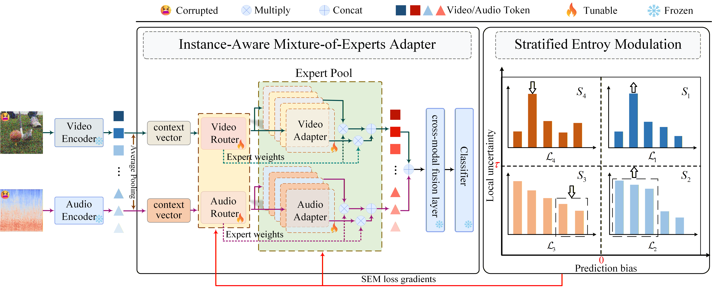

# Modulate-Then-Integrate: Redefining Instance Features for Multi-Modal Test-Time Adaptation (MTI)

This repository contains the **official implementation** of **MTI**, a multi-modal test-time adaptation (MM-TTA) method designed for **simultaneous multimodal domain shifts**.

---

## Framework

<p align="center">
  
</p>

## Overview

Multi-modal models often degrade under distribution shifts at deployment time. Prior MM-TTA methods typically adapt by recalibrating **fusion attention**, which can fail when **all modalities are corrupted simultaneously** (no reliable anchor modality).  
**MTI** tackles this challenge by **modulating instance-level representations before fusion**, and then integrating the corrected tokens for robust predictions.

MTI consists of two key components:

- **IAMA (Instance-Aware Mixture-of-Experts Adapter)**: instance-specific token modulation via expert mixing and lightweight routing.
- **SEM (Stratified Entropy Modulation)**: reliability-aware optimization that stabilizes adaptation under overconfidence and bias.

---

> 🔥 Tunable modules: IAMA (router + experts + gating)  
> ❄️ Frozen modules: encoders, fusion layer, and classifier (default setting)

---

## Key Methods

- **Instance-Aware Mixture-of-Experts Adapter (IAMA)**
  - Maintains an expert pool for each modality and produces instance-specific expert weights for token modulation.
- **Stratified Entropy Modulation (SEM)**
  - Stratifies samples by reliability and applies stratum-specific entropy objectives to stabilize test-time updates.

---

## Getting Started

### Requirements

We recommend the following environment (you may adjust based on your setup):

- python >= 3.8
- torch >= 1.13
- torchvision >= 0.14
- torchaudio >= 0.13
- timm
- numpy, tqdm, scikit-learn

Install dependencies:

```bash
pip install -r requirements.txt
